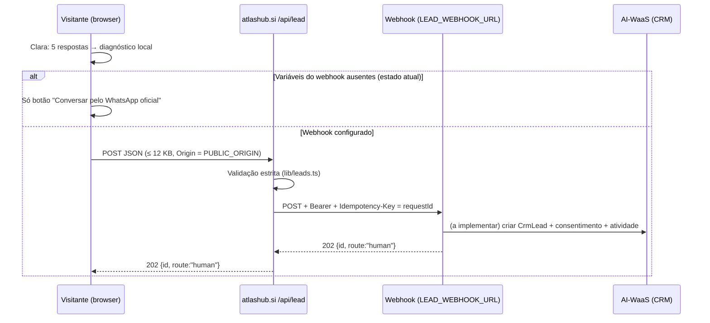

# Arquitetura — atlashub.si

Next.js 16 (App Router), React 19, TypeScript, Node 24, Vercel (projeto `atlashub-si`, branch `main` → produção). Sem base de dados própria, sem sessão, sem cookies.

## 1. Mapa de rotas

| Rota | Tipo | Dados | Servidor? |
|---|---|---|---|
| `/` | Página estática | Desktop ≥ 900 px: ecrã 1:1 da maquete (`lib/mockups/home.json`); móvel: secções responsivas (`lib/site.ts`, `lib/cases.ts`) | Não |
| `/solucoes/ai-workforce` | Página estática | `lib/mockups/ai-workforce.json` + secções | Não |
| `/solucoes/enterprise-transformation` | Página estática | `lib/mockups/enterprise-transformation.json` + secções | Não |
| `POST /api/lead` | Route handler (Node) | Pedido da Clara → reencaminhado para um webhook | **Sim** — único ponto de servidor |

## 2. Componentes por natureza

| Natureza | Componentes | Nota para o backend |
|---|---|---|
| **Estático / conteúdo** | Header, Hero, Offers, Areas, Method, Cases, Ecosystem, Editions, Closing, Footer, ecrãs 1:1 (`MockupCanvas`) | Os números e perfis dos ecrãs 1:1 são **ilustrativos** (decisão da direção, 08/10/2026). Não ligar a dados reais sem decisão. |
| **Simulação local** | Clara (pré-análise guiada por regras, sem LLM), OperationLab (`lib/simulation.ts`) | Corre só no browser. Nada é enviado. O "diagnóstico" é descarregável em ficheiro pelo próprio visitante. |
| **Contacto** | Clara → WhatsApp (sempre); Clara → `POST /api/lead` (só se as variáveis do webhook existirem no build) | Ver [INTEGRACAO-BACKEND.md](INTEGRACAO-BACKEND.md) |

## 3. Fluxo do lead

## 4. Dependências externas

| Destino | Como | Estado |
|---|---|---|
| WhatsApp oficial `+55 62 99190-3462` | Links `wa.me` com mensagem pré-preenchida; o visitante envia | Ativo |
| `app.atlashub.si` | Links (simuladores, biblioteca, painel) | Ativo |
| `editions.atlashub.si` | Links (Conhecimento, livro) | Ativo |
| Webhook de leads | `fetch` servidor → servidor | **Não configurado** |
| Fontes | Figtree, Barlow Semi Condensed e Inter alojadas em `public/fonts` e `app/` (sem Google Fonts) | Ativo |

## 5. Segurança já implementada em `/api/lead`

- `Origin` tem de ser exatamente `PUBLIC_ORIGIN` (por defeito `https://atlashub.si`) → 403.
- `Content-Type: application/json` obrigatório → 415.
- Corpo lido em stream e cortado a 12 000 bytes → 413.
- Validação estrita de tipos, tamanhos, email, telefone (`+` internacional), UUID do pedido, enumerações do diagnóstico, cenário existente → 400.
- Honeypot `website` e `consent === true` obrigatórios.
- Webhook só HTTPS, `redirect: "error"`, timeout 8 s, `Idempotency-Key`.
- Resposta `Cache-Control: no-store`.

**Em falta** (ver backlog): rate limiting / anti-bot, registo de auditoria do lado do site, monitorização de 5xx.
